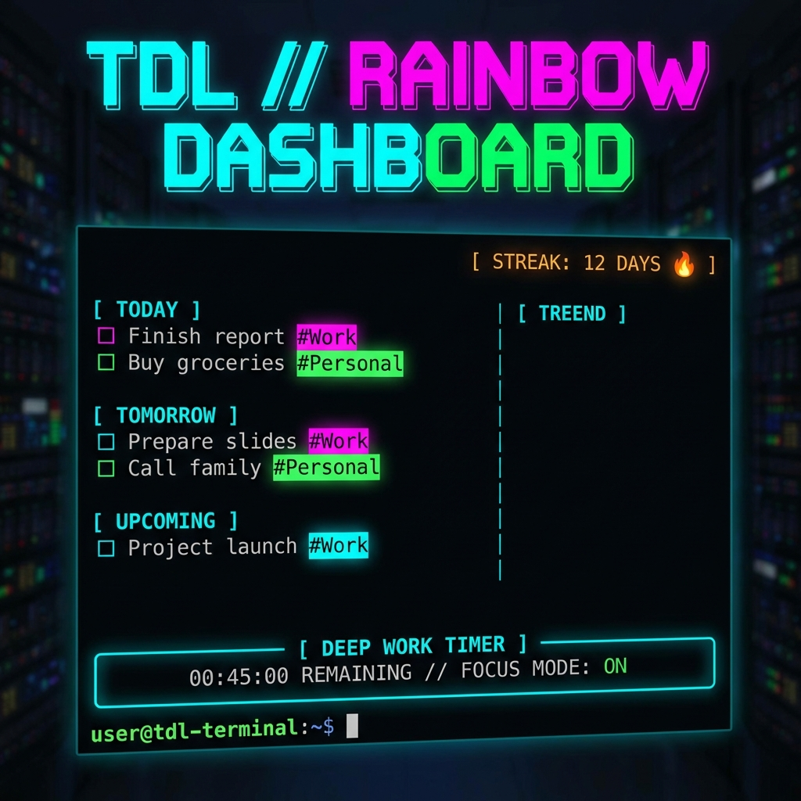

<div align="center">

# 🚀 Zenith CLI: The Ultimate Terminal Task Manager

**Lightning Fast. Beautifully Organized. Distraction Free.**



[](https://www.python.org/)
[](https://github.com/tiangolo/typer)
[](https://github.com/Textualize/rich)

</div>

---

## 🌟 Introduction

**Zenith CLI** is a powerful, keyboard-centric task manager built for developers and power users who live in the terminal. Say goodbye to bloated GUI apps and context switching. Zenith brings your tasks, goals, and focus tools directly to your command line with stunning **Rainbow Visuals** and **Instant Performance**.

Designed to be "fast as thought", Zenith CLI ensures you spend less time managing tasks and more time actually doing them.

---

## ✨ Key Features

* **🌈 Rainbow Dashboard**: Your tasks, auto-organized by time (Today, Tomorrow, Upcoming) and visualized with vibrant, customizable colors.
* **⏱️ Deep Work Mode**: A built-in focus timer that launches a dedicated session window with a visual progress bar.
* **🔥 Productivity Streaks**: Gamify your workflow. Track your daily consistency with a lit fire streak indicator.
* **🔁 Recurring Tasks**: Set it and forget it. Configure daily, weekly, or custom recurring tasks.
* **📅 Event Tracking**: Distinguish specific calendar events (prefixed with `📅`) from your regular to-do items.
* **🗂️ Advanced Organization**:
    * **Categories**: Tag tasks (e.g., `#Work`, `#Personal`) with auto-hashed colors.
    * **Goal Notebook**: Separate high-level goals from daily tasks.
    * **History**: Archive and review your completed accomplishments.

---

## 📦 Installation

1.  **Clone the repository**:
    ```bash
    git clone [https://github.com/DSLucas19/Zenith-CLI-Your-Command-Line-Productivity-Hub.git](https://github.com/DSLucas19/Zenith-CLI-Your-Command-Line-Productivity-Hub.git)
    cd Zenith-CLI-Your-Command-Line-Productivity-Hub
    ```

2.  **Install dependencies**:
    ```bash
    pip install -r requirements.txt
    ```

3.  **Run the App**:
    ```bash
    ./TDL.bat
    # Or
    python main.py
    ```

---

## ⌨️ Command Reference

| Command | Alias | Description |
| :--- | :--- | :--- |
| `TDL db` | `dashboard` | **View Main Dashboard** - The command center. |
| `TDL add "Task"` | | Add a simple task. |
| `TDL add "Task" -r` | | Add a **recurring** task (interactive setup). |
| `TDL check` | | **Complete tasks** via interactive checklist. |
| `TDL work <ID>` | | Start a **Deep Work** session for a specific task. |
| `TDL event "Title"` | | Add a calendar event (asks for date/time). |
| `TDL today` | | View tasks & events for **Today** only. |
| `TDL tomorrow` | | View tasks & events for **Tomorrow**. |
| `TDL rc` | | Manage recurring tasks. |
| `TDL goals` | | Open the Goals notebook. |
| `TDL cat` | | Manage categories. |
| `TDL ?` | `intro` | Detailed introduction and features. |
| `TDL` | `welcome` | The main welcome tab of the app. |

---

## 📖 A Day with Zenith (Walkthrough)

1.  **Morning Briefing**: Run `TDL today` to see what's on your plate.
2.  **Capture**: Recall something? `TDL add "Review PRs" -c Work`.
3.  **Deep Focus**: Time to code. `TDL work 1`.
4.  **Review**: Finished? `TDL check` -> Select the task -> **Done**.
5.  **Wind Down**: Check `TDL tomorrow` to prep for the next day.

---

<div align="center">
Built with ❤️ for the Command Line.
</div>


